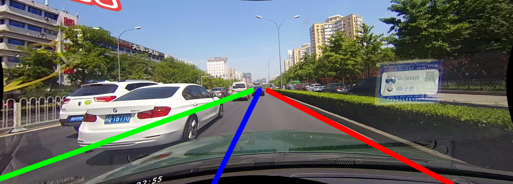
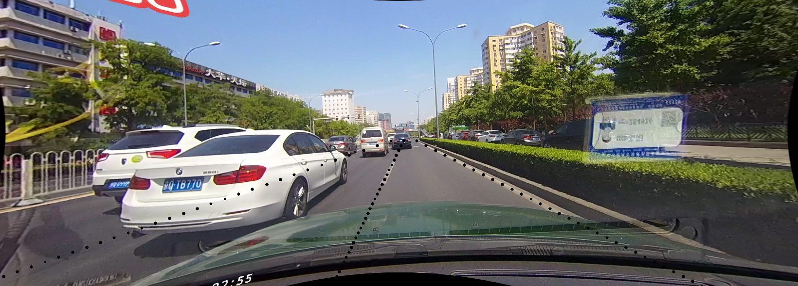

# Welcome to pytorch-auto-drive visualization tutorial

https://user-images.githubusercontent.com/32259501/124349679-1ccb8c80-dc23-11eb-9864-46978138c9bd.mp4

Colors can be specified in [configs.yaml](../configs.yaml) for each dataset.

[vis_tools.py](../tools/vis_tools.py) contains batch-wise visualization functions to modify for your own use case.

## Segmentation mask (Image/Video/Folder)

Use [visualize_segmentation.py](../visualize_segmentation.py) to visualize segmentation results, by providing the image with `--image-path` and mask (**not the colored ones**) with `--mask-path`, also `--dataset` needs to be specified for color selection. For detailed instructions, run:

```
python visualize_segmentation.py --help
```

For example, visualize with PASCAL VOC 2012 setting:

```
python visualize_segmentation.py --image-path=test_images/voc_test_image.jpg --mask-path=test_images/voc_test_mask.png --save-path=test_images/voc_test.png --dataset=voc
```

You should be able to see the result like this stored at `--save-path`:

<div align="center">
  
</div>

If mask is not provided, an inference will be performed by the model specified with `--model` and `--continue-from`, you can define input resolution with `--height` and `--width`, but the result will always be resized to the original image:

```
python visualize_segmentation.py --image-path=test_images/voc_test_image.jpg --save-path=test_images/voc_pred.png --model=deeplabv2 --dataset=voc --mixed-precision --continue-from=deeplabv2_pascalvoc_321x321_20201108.pt --height=505 --width=505
```

### Image folder or videos

`--image-path` and `--save-path` can also be image folder or video. You can try a demo video we made from Cityscapes: [link](https://drive.google.com/file/d/1IuDESvUgaTUHQ7Vw_V29_Jty3eqkOvcL/view?usp=sharing).

To generate more demo videos like that on Cityscapes, you can download the official demo files, and run:

```
python tools/generate_cityscapes_demo.py
```

## Lane points

Use [visualize_lane.py](../visualize_lane.py) to visualize lane detection results. For detailed instructions, run:

```
python visualize_lane.py --help
```

By providing a mask with `--mask-path`, lanes will be drawn as non-transparent segmentation masks:

```
python visualize_lane.py --image-path=test_images/culane_test_image.jpg --mask-path=test_images/culane_test_mask.png --save-path=test_images/culane_test.png --dataset=culane
```

The result will be like this:

<div align="center">
  
</div>

You can also draw sample points with `--keypoint-path` in the CULane format, for example:

```
python visualize_lane.py --image-path=test_images/culane_test_image.jpg --keypoint-path=test_images/culane_test_keypoint.txt --save-path=test_images/culane_test.png --dataset=culane
```

<div align="center">
  
</div>

Sample points and segmentation mask can be drawn together if both files are provided.
