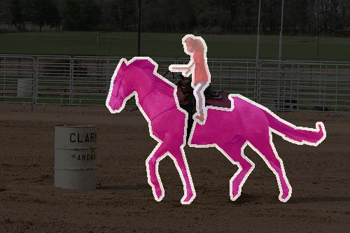
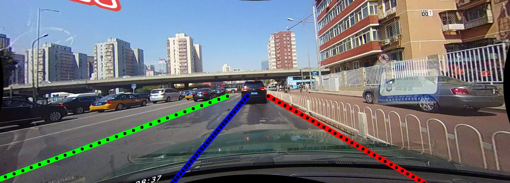
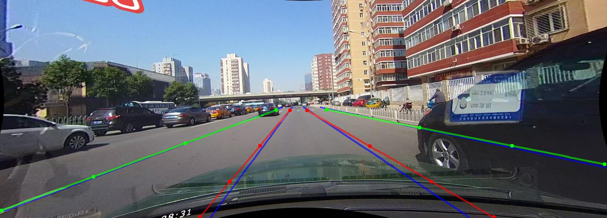

# Welcome to PytorchAutoDrive visualization tutorial

Trained models used for inference can be found at [MODEL_ZOO.md](../docs/MODEL_ZOO.md).

To quickly get some results, download [PAD_test_images](https://drive.google.com/file/d/1XQvBS1uoHeIgUv7oDQ4Vp1tWYi0oAGhU/view?usp=sharing) (129MB). It includes sample images and videos from TuSimple, CULane, Cityscapes and PASCAL VOC 2012.

After download, unzip it as:

```
unzip PAD_test_images.zip -d PAD_test_images
```

## Segmentation mask (Image Folder)

Use [tools/vis/seg_img_dir.py](../tools/vis/seg_img_dir.py) to visualize segmentation results, by providing the image folder with `--image-path` and mask (**not the colored ones**) with `--target-path`. For detailed instructions, run:

```
python tools/vis/seg_img_dir.py --help
```

For example, visualize a PASCAL VOC image:

```
python tools/vis/seg_img_dir.py --image-path=PAD_test_images/seg_test_images/voc --image-suffix=_image.jpg --target-path=PAD_test_images/seg_test_images/voc --target-suffix=_mask.png --save-path=PAD_test_images/seg_test_images/voc_res --config=<any PASCAL VOC config>
```

You should be able to see the result like this stored at `--save-path` with same image names as in `--image-path`:

<div align="center">
  
</div>

You can also do inference by `--pred`, in this case you'll need the correct `--config` and `--checkpoint`, for example:

```
python tools/vis/seg_img_dir.py --image-path=PAD_test_images/seg_test_images/voc --image-suffix=_image.jpg --save-path=PAD_test_images/seg_test_images/voc_pred --pred --config=configs/semantic_segmentation/deeplabv2/resnet101_pascalvoc_321x321.py --checkpoint=deeplabv2_pascalvoc_321x321_20201108.pt
```

Another example for visualizing complex filename and structure such as Cityscapes (Remember to use `--map-id` for Cityscapes style annotation files):

```
python tools/vis/seg_img_dir.py --image-path=PAD_test_images/seg_test_images/munster --image-suffix=_leftImg8bit.png --target-path=PAD_test_images/seg_test_images/labels/munster --target-suffix=_gtFine_labelIds.png --save-path=PAD_test_images/seg_test_images/city_res --config=configs/semantic_segmentation/erfnet/cityscapes_512x1024.py --map-id
```

## Segmentation mask (Video)

Since there are no video labels available from all supported datasets, inference must be conducted, for example:

```
python tools/vis/seg_video.py --video-path=PAD_test_images/seg_test_images/stuttgart_00.avi --save-path=PAD_test_images/seg_test_images/stuttgart_pred.avi --config=configs/semantic_segmentation/erfnet/cityscapes_512x1024.py --checkpoint=erfnet_cityscapes_512x1024_20200918.pt
```

## Lane points (Image Folder)

Use [tools/vis/lane_img_dir.py](../tools/vis/lane_img_dir.py) to visualize arbitrary lane detection results, by providing the image folder with `--image-path`, keypoint file folder (**CULane format**) with `--keypoint-path` and optional segmentation mask (**not the colored ones**) with `--mask-path`. For detailed instructions, run:

```
python tools/vis/lane_img_dir.py --help
```

Try `--style` for different lane line styles (currently supports `point`, `line` & `bezier`):

- `--style=point`: Sample points will be drawn directly
- `--style=line`: Sample points will be connected with semi-transparent lines (you can get a neat visual on curve-based methods, but possible unpleasant zigzag lines for segmentation-based methods)
- `--style=bezier`: Same as `--style=line`, additionally adds Bézier control points for Bézier curve-based methods

For example, visualize on CULane:

```
python tools/vis/lane_img_dir.py --image-path=PAD_test_images/lane_test_images/05171008_0748.MP4 --keypoint-path=PAD_test_images/lane_test_images/05171008_0748.MP4 --mask-path=PAD_test_images/lane_test_images/laneseg_label_w16/05171008_0748.MP4 --image-suffix=.jpg --keypoint-suffix=.lines.txt --mask-suffix=.png --save-path=PAD_test_images/lane_test_images/culane_res --config=<any CULane config>
```

You should be able to see the result like this stored at `--save-path` with same image names as in `--image-path`:

<div align="center">
  
</div>

You can also do inference by `--pred`, in this case you'll need the correct `--config` and `--checkpoint`, for example:

```
python tools/vis/lane_img_dir.py --image-path=PAD_test_images/lane_test_images/05171008_0748.MP4 --image-suffix=.jpg --save-path=PAD_test_images/lane_test_images/culane_pred --pred --config=configs/lane_detection/baseline/erfnet_culane.py --checkpoint=erfnet_baseline_culane_20210204.pt
```

## Lane points (Video)

Since there are no video labels available from all supported datasets, inference must be conducted, for example:

```
python tools/vis/lane_video.py --video-path=PAD_test_images/lane_test_images/tusimple_val_1min.avi --save-path=PAD_test_images/lane_test_images/tusimple_val_1min_pred.avi --config=configs/lane_detection/baseline/erfnet_tusimple.py --checkpoint=erfnet_baseline_tusimple_20210424.pt
```

## Lane points (compare with GT)

In **Lane points (Image Folder)**, you literally visualized one set of text files on one set of images. While with two sets of text files, you can additionally compare with Ground Truth (typical use case when analyzing or worse: writing a paper). Provide GT keypoints by `--gt-keypoint-path` and set the evaluation metric by `--metric`, currently only `culane` and `tusimple` are supported (note that the `culane` metric here is the Python version, which slightly differs from the official C++ implementation). You may also use `--pred` to predict from a model instead of `--keypoint-path` to provide predictions.

For example, compare against GT with BézierLaneNet:

```
python tools/vis/lane_img_dir.py --image-path=PAD_test_images/lane_test_images/05171008_0748.MP4 --gt-keypoint-path=PAD_test_images/lane_test_images/05171008_0748.MP4  --image-suffix=.jpg --gt-keypoint-suffix=.lines.txt --save-path=PAD_test_images/lane_test_images/culane_gt_compare --config=configs/lane_detection/bezierlanenet/resnet34_culane-aug1b.py --style=bezier --checkpoint=resnet34_bezierlanenet_culane_aug1b_20211109.pt --mixed-precision --pred
```

You can get red **False Positive**, green **True Positive** and blue **Ground Truth**, like this:

<div align="center">
  
</div>

The extra takeaway here is: you can visualize prediction results from implementations other than PytorchAutoDrive, which makes things easier when comparing a wide range of methods. Refer to [ADVANCED_TUTORIAL.md](./ADVANCED_TUTORIAL.md) for visualizing on specific dataset file structures (e.g., TuSimple selectively use images from different sub folders, and use one json file for all annotations).

## Advanced Visualization

You can set `--image-path` or `--target-path` to your dataset paths in order to visualize a customized dataset, but keep in mind about `--save-path`: **don't accidentally overwrite your dataset!**

Use large `batch_size`, more `workers` or `--mixed-precision` to accelerate visualization same as training/testing.

To generate videos from Cityscapes like our sample video, you can download the demo files from Cityscapes website, modify and run `tools/generate_cityscapes_demo.py`

To generate videos from TuSimple like our sample video, modify and run `tools/tusimple_to_video.py`

Colors can be customized for each dataset in `utils/datasets/`, although we recommend not doing that and keep the official colors for each dataset. If you are using custom data/custom model with more predicted classes but never did modify the code, the class colors will be used iteratively.

[vis_utils.py](../utils/vis_utils.py) contains batch-wise visualization functions to modify for your own use case.

You can set a `vis_dataset` dict in your config file to init the `ImageFolder` or `VideoLoader` classes from config file, otherwise it is automatically initiated by commandline args.

You can set a `vis` dict in your config file, this way the visualizer will use this dict's options instead of `test`.

For advanced visualization that includes actual coding, refer to [ADVANCED_TUTORIAL.md](./ADVANCED_TUTORIAL.md).
